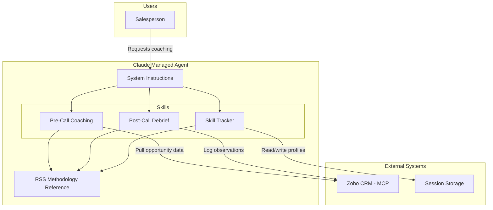

# D098: RSS Platform Phase 1 Implementation Plan

> **For agentic workers:** REQUIRED SUB-SKILL: Use superpowers:subagent-driven-development (recommended) or superpowers:executing-plans to implement this plan task-by-task. Steps use checkbox (`- [ ]`) syntax for tracking.

**Goal:** Create the `alexander-proudfoot/rss-platform` repository with digitised RSS methodology, agent skills, and managed agent configuration for an internal AI sales coaching proof of concept.

**Architecture:** Methodology-first agent build. RSS source material (SharePoint) is digitised into structured markdown files, then encoded into SKILL.md files following the Sales Engine pattern (YAML frontmatter, Quick Reference, When to Use, Inputs, Workflow, Anti-Patterns). A Claude Managed Agent is configured with system instructions referencing these skills, integrated with Zoho CRM via MCP.

**Tech Stack:** Claude Managed Agents API, Zoho CRM MCP, structured markdown (SKILL.md pattern), GitHub Actions

---

## Scope Check

This plan covers a single system: the RSS Platform coaching agent. All files live in one repository. No sub-project split needed.

## File Structure

### Files to Create (27 files)

**Governance & Scaffold (Phase A: 7 files)**

| File | Responsibility |
|------|----------------|
| `CLAUDE.md` | Claude Code context file (from CLAUDE-TEMPLATE v4.3, adapted for non-SWA agent architecture) |
| `REVIEW.md` | Code review checklist (from REVIEW-TEMPLATE, adapted for non-SWA agent architecture) |
| `README.md` | Project documentation (overwrite auto-generated) |
| `.claude/settings.json` | 13-plugin standard set |
| `.github/workflows/auto-add-to-project.yml` | Auto-add issues to Product Board |
| `.github/workflows/claude.yml` | Claude Code Review on PRs |
| `.gitignore` | Node gitignore (auto-generated by GitHub) |

**Methodology (Phase B: 5 files)**

| File | Responsibility |
|------|----------------|
| `methodology/rss-situational-matrix.md` | Foundational framework: 4 quadrants, movement dynamics, skill-to-quadrant mappings |
| `methodology/rss-5-unit-model.md` | All 5 RSS units with techniques, application contexts, progression logic |
| `methodology/rss-coaching-methodology.md` | C2E coaching framework, observation protocols, feedback structures |
| `methodology/rss-sales-mos.md` | Sales Management Operating System: pipeline, activity metrics, coaching cadence |
| `methodology/miller-heiman-exclusion-register.md` | Every excluded MH concept with Proudfoot-native replacement or placeholder |

**Skills (Phase C: 4 files)**

| File | Responsibility |
|------|----------------|
| `skills/pre-call-coaching/SKILL.md` | Pre-call coaching agent skill |
| `skills/post-call-debrief/SKILL.md` | Post-call debrief agent skill |
| `skills/skill-tracker/SKILL.md` | Skill development tracking agent skill |
| `skills/shared/rss-methodology-reference.md` | Context-window-optimised shared reference for all skills |

**Agent Configuration (Phase D: 3 files)**

| File | Responsibility |
|------|----------------|
| `agent/system-instructions.md` | Managed agent system prompt: persona, methodology, coaching philosophy, IP protection, MH exclusion |
| `agent/tool-definitions.md` | Tool/MCP connection documentation (Zoho CRM read/write, session persistence) |
| `agent/managed-agent-config.yaml` | Managed Agents API deployment configuration |

**Tests (Phase D: 3 files)**

| File | Responsibility |
|------|----------------|
| `tests/test-pre-call-coaching.md` | 3 structured test scenarios for pre-call coaching |
| `tests/test-post-call-debrief.md` | 3 structured test scenarios for post-call debrief |
| `tests/test-skill-tracker.md` | 2 structured test scenarios for skill tracking |

**Documentation (Phase D: 1 file)**

| File | Responsibility |
|------|----------------|
| `docs/architecture.md` | Phase 1 architecture with Mermaid diagram |

**Audit (committed during build)**

| File | Responsibility |
|------|----------------|
| `Audit/build-plans/D098-plan.md` | This plan |

**Directory stubs (created at scaffold)**

| Path | Purpose |
|------|---------|
| `methodology/` | RSS methodology source files |
| `skills/` | SKILL.md files |
| `skills/pre-call-coaching/` | Pre-call coaching skill directory |
| `skills/post-call-debrief/` | Post-call debrief skill directory |
| `skills/skill-tracker/` | Skill tracker skill directory |
| `skills/shared/` | Shared reference files |
| `agent/` | Agent configuration |
| `tests/` | Test scripts |
| `docs/` | Architecture documentation |
| `Audit/build-plans/` | Build plans |
| `Audit/logs/` | Script logs |

---

## Execution Order & Dependencies

```
Phase A (scaffold) ── no dependencies, creates the repo
    │
Phase B (methodology) ── depends on Phase A + SharePoint source access
    │
    ├── miller-heiman-exclusion-register.md ── no dependency on SharePoint, can be written from D098
    ├── rss-situational-matrix.md ── SharePoint: Trainer's Guide, Facilitator's Guide
    ├── rss-5-unit-model.md ── SharePoint: Trainer's Guide, Participant Manual, Facilitator's Guide
    ├── rss-coaching-methodology.md ── SharePoint: Coaching Manual
    └── rss-sales-mos.md ── SharePoint: Trainer's Guide Sales MOS sections
    │
Phase C (skills) ── depends on Phase B methodology files
    │
    ├── rss-methodology-reference.md ── condensed from all Phase B files
    ├── pre-call-coaching/SKILL.md ── references methodology + Situational Matrix
    ├── post-call-debrief/SKILL.md ── references methodology + Situational Matrix
    └── skill-tracker/SKILL.md ── references methodology + all 5 units
    │
Phase D (agent config) ── depends on Phase C skills
    │
    ├── system-instructions.md ── references all skills + methodology
    ├── tool-definitions.md ── Zoho CRM MCP documentation
    ├── managed-agent-config.yaml ── references system instructions
    ├── tests/*.md ── test scripts for each capability
    ├── docs/architecture.md ── documents the full architecture
    └── README.md update ── comprehensive project documentation
    │
Phase E (MH verification) ── depends on Phase D
    │
Phase F (commit/push) ── depends on Phase E clean
    │
Phase G (PR + bot review) ── depends on Phase F
```

---

## Source Documents (SharePoint via M365 MCP)

| Methodology File | SharePoint Source Documents | Risk |
|-----------------|---------------------------|------|
| `rss-situational-matrix.md` | RSS Trainer's Guide, RSS Facilitator's Guide | Core framework — must be found |
| `rss-5-unit-model.md` | RSS Trainer's Guide, RSS Participant Manual, RSS Facilitator's Guide | Largest digitisation effort |
| `rss-coaching-methodology.md` | RSS Coaching Manual (Bowater RSS Coaching Manual reference) | May be under legacy naming |
| `rss-sales-mos.md` | RSS Trainer's Guide Sales MOS sections | May be integrated within Trainer's Guide, not standalone |
| `miller-heiman-exclusion-register.md` | D098 handoff (this document) | No SharePoint dependency |

**STOP condition:** If any RSS source document cannot be located on SharePoint via M365 MCP, STOP and report to Neil. Do not fabricate methodology content.

---

## Risk Areas

| Risk | Severity | Mitigation |
|------|----------|------------|
| RSS source documents not found on SharePoint | **High** | Search M365 MCP with multiple naming variants. STOP and report if not found. |
| Miller Heiman terminology leaks into methodology files | **Critical** | MH exclusion register written first. Grep verification after every Phase B/C file. Final verification gate before PR. |
| Sales Engine skills contain MH IP that could be inadvertently copied | **High** | RSS skills are written fresh from RSS sources, not adapted from Sales Engine. Sales Engine is pattern reference only (structure, not content). |
| Coaching Manual under legacy naming (Bowater reference) | **Medium** | Search SharePoint for "Bowater", "RSS Coaching", "Coaching Manual", "C2E" variants. |
| Claude Managed Agents API documentation gaps | **Medium** | API is new (8 Apr 2026). Config file structure may need adjustment after deployment testing. Mark config as Phase 1 draft. |
| Zoho CRM MCP integration not verified in agent context | **Low** | Phase 1 documents the integration; actual testing is Phase 2. Tool definitions describe the intended MCP connection. |

---

## Miller Heiman Verification

**Verification gate (run before Phase G PR creation):**

```bash
grep -rni "economic buyer\|user buyer\|technical buyer\|buying influence\|win-results\|red flag\|sponsorship gap\|concept.*mode.*rating\|perspective.*strateg" --include="*.md" --include="*.yaml" --include="*.json" --include="*.ts" --include="*.js" . | grep -v "miller-heiman-exclusion-register"
```

**Must return zero results.** If any match found, fix before proceeding.

**Additional check — Sales Engine terminology that must not appear:**

```bash
grep -rni "EBI\|economic buyer\|user buyer\|technical buyer\|buying influence\|coach.*stakeholder\|win-results\|red flag\|mode.*growth.*trouble\|even keel\|overconfident\|concept.*accomplish.*fix.*avoid" --include="*.md" --include="*.yaml" . | grep -v "miller-heiman-exclusion-register"
```

---

## Known Gotchas Applicable to This Build

| Gotcha # (Template) | Applies? | How |
|---------------------|----------|-----|
| #16 Plugins | Yes | Load all 14 plugins at session start (Amendment 1: agent-sdk-dev is the 14th) |
| #19 Plan-first (D088) | Yes | This plan. STOP for user review. |
| #20 Playwright | No | No frontend in Phase 1 |
| #21 Pattern sweep | Yes | Bot findings must be swept across all files |
| #22 MSYS path rewriting | Yes | Windows local execution — set `MSYS_NO_PATHCONV=1` for `gh api` calls |
| #23 Claude Code Review enablement | Yes | New repo — must be enabled at claude.ai/admin-settings. Create issue for Neil. |
| #24 Bot cycling | Yes | Exit after 2 rounds with no new unique findings |
| #26 `gh pr checks --watch` | Yes | Use for Phase G bot wait |

---

## Plugin Orchestration Per Task

| Task | Plugins / Agents |
|------|-----------------|
| Phase A: Repo creation | GitHub MCP (`mcp__plugin_github_github__create_repository`) |
| Phase A: CLAUDE.md | claude-md-management (audit after creation) |
| Phase A: Scaffold commit | commit-commands (`/commit`) |
| Phase B: Each methodology file | superpowers (`/Skill(review)`) after each file |
| Phase B: MH exclusion register | No special plugin — written from D098 content |
| Phase C: Each SKILL.md | feature-dev:code-reviewer after each skill |
| Phase C: Shared reference | code-simplifier after creation (context-window optimisation) |
| Phase D: System instructions | superpowers (`/Skill(review)`), security review for IP protection |
| Phase D: Agent config | agent-sdk-dev verification |
| Phase E: MH verification | Bash grep — no plugin needed |
| Phase F: Pre-push review | code-review (`/code-review`) |
| Phase G: PR creation | commit-commands (`/commit-push-pr`), pr-review-toolkit |
| Phase G: Bot wait | `gh pr checks --watch` |

---

## Tasks

### Task 1: Create Repository and Scaffold

**Files:**
- Create: `alexander-proudfoot/rss-platform` (GitHub repo)
- Create: `.claude/settings.json`
- Create: `.github/workflows/auto-add-to-project.yml`
- Create: `.github/workflows/claude.yml`
- Overwrite: `README.md` (placeholder)

- [ ] **Step 1: Create the repository on GitHub**

```bash
# Using GitHub MCP tool: mcp__plugin_github_github__create_repository
# name: rss-platform
# organization: alexander-proudfoot
# description: "RSS Platform — AI sales coaching agent encoding Proudfoot's Relationship Selling Skills methodology"
# private: false
# autoInit: true (creates README.md, .gitignore)
```

- [ ] **Step 2: Clone the repository locally**

```bash
cd C:/Dev
git clone https://github.com/alexander-proudfoot/rss-platform.git
cd rss-platform
```

- [ ] **Step 3: Create directory structure**

```bash
mkdir -p methodology skills/pre-call-coaching skills/post-call-debrief skills/skill-tracker skills/shared agent tests docs Audit/build-plans Audit/logs .claude .github/workflows
```

- [ ] **Step 4: Create `.claude/settings.json`**

```json
{
  "enabledPlugins": {
    "frontend-design@claude-plugins-official": true,
    "code-review@claude-plugins-official": true,
    "github@claude-plugins-official": true,
    "commit-commands@claude-plugins-official": true,
    "security-guidance@claude-plugins-official": true,
    "superpowers@claude-plugins-official": true,
    "typescript-lsp@claude-plugins-official": true,
    "pr-review-toolkit@claude-plugins-official": true,
    "claude-md-management@claude-plugins-official": true,
    "playwright@claude-plugins-official": true,
    "feature-dev@claude-plugins-official": true,
    "skill-creator@claude-plugins-official": true,
    "code-simplifier@claude-plugins-official": true,
    "agent-sdk-dev@claude-plugins-official": true
  }
}
```

Note: 14-plugin standard set (Amendment 1 — agent-sdk-dev added).

- [ ] **Step 5: Create `.github/workflows/auto-add-to-project.yml`**

```yaml
name: Auto-add Issues to Project Board

on:
  issues:
    types: [opened]

permissions:
  issues: read

jobs:
  add-to-project:
    runs-on: ubuntu-latest
    steps:
      - name: Add Issue to Project
        uses: actions/add-to-project@v1.0.2
        with:
          project-url: https://github.com/orgs/alexander-proudfoot/projects/3
          github-token: ${{ secrets.PROJECT_PAT }}
```

- [ ] **Step 6: Create `.github/workflows/claude.yml`**

```yaml
name: Claude Code
on:
  issue_comment:
    types: [created]
  pull_request_review_comment:
    types: [created]
  pull_request:
    types: [opened, synchronize]

jobs:
  claude:
    if: |
      (github.event_name == 'pull_request') ||
      (github.event_name == 'issue_comment' && contains(github.event.comment.body, '@claude')) ||
      (github.event_name == 'pull_request_review_comment' && contains(github.event.comment.body, '@claude'))
    runs-on: ubuntu-latest
    permissions:
      contents: read
      pull-requests: write
      issues: write
    steps:
      - uses: actions/checkout@v4
        with:
          fetch-depth: 1
      - uses: anthropics/claude-code-action@v1
        with:
          anthropic_api_key: ${{ secrets.ANTHROPIC_API_KEY }}
```

- [ ] **Step 7: Commit scaffold to main**

```bash
git add .claude/settings.json .github/workflows/auto-add-to-project.yml .github/workflows/claude.yml
git commit -m "chore: add governance scaffold (plugins, workflows)"
git push origin main
```

Note: This push goes directly to main before branch protection is enabled (per handoff exception for Phase A infrastructure).

### Task 2: Create CLAUDE.md

**Files:**
- Create: `CLAUDE.md`

- [ ] **Step 1: Write CLAUDE.md**

Derive from CLAUDE-TEMPLATE v4.3. Key adaptations for non-SWA agent architecture:

**REMOVE these SWA-specific sections:**
- Authentication -- SWA Platform Auth
- x-ms-client-principal Structure
- Azure AD App Registration
- Proudfoot Azure IDs (client ID, SWA settings)
- API -- Key Vault Fallback Pattern
- Standard Patterns > Quick/Deep AI Mode Selector (SWA-specific)
- SWA-specific Known Gotchas: #1 (MSAL), #2 (token signing), #3 (client principal), #4 (DefaultAzureCredential), #5 (staticwebapp.config.json), #6 (ID tokens), #7 (Cache-Control), #13 (/.auth anonymous), #14 (allowedRoles), #17 (preview env DB routing), #18 (45-second timeout), #25 (preview env AAD redirect)

**RETAIN these governance sections (renumber):**
- Project (adapted: no SWA URL, no deploy pipeline)
- Plugins (D078) — 13-plugin standard set, all `/plugin` commands
- Shell Tools
- Script Logging
- TypeScript Rules (in case any TS is introduced)
- Known Gotcha #8 (npm ci/package-lock.json)
- Known Gotcha #16 (plugins require explicit loading)
- Known Gotcha #19 (plan-first, D088)
- Known Gotcha #21 (pattern sweep)
- Known Gotcha #22 (MSYS path rewriting)
- Known Gotcha #23 (Claude Code Review enablement)
- Known Gotcha #24 (bot cycling)
- Known Gotcha #26 (`gh pr checks --watch`)
- Known Gotcha #27 (federated credential idempotency) — retain for future
- Known Gotcha #28 (privileged script permissions) — retain for future
- Azure Naming
- Branch Protection
- Audit Logging

**ADD these new sections:**
- **Claude Managed Agents** — documents the agent deployment pattern (replaces SWA deployment)
- **RSS Methodology** — lists methodology files and their purpose
- **Agent Skills** — lists SKILL.md files and when each is used
- **Miller Heiman IP Exclusion** — the verification grep command and enforcement rule
- **Zoho CRM Integration** — documents the MCP connection pattern

- [ ] **Step 2: Run claude-md-management audit**

Invoke `claude-md-management:claude-md-improver` agent on the new CLAUDE.md.

- [ ] **Step 3: Commit**

```bash
git add CLAUDE.md
git commit -m "chore: add CLAUDE.md (v4.3 adapted for Managed Agents architecture)"
```

### Task 3: Create REVIEW.md

**Files:**
- Create: `REVIEW.md`

- [ ] **Step 1: Write REVIEW.md**

Derive from REVIEW-TEMPLATE. Adapt for non-SWA:

**REMOVE:**
- Section 1 (SWA Platform Auth Compliance) — not applicable
- Section 2 (MSAL Version Compatibility) — not applicable
- Section 5 (Azure AD App Registration Alignment) — not applicable
- Section 7 (Deployment and Configuration) — SWA-specific checks

**RETAIN (adapted):**
- Section 3 (TypeScript Compilation) — if any TS introduced
- Section 4 (Environment Variables and Secrets) — adapted for agent context
- Section 6 (Package Management) — if package.json introduced

**ADD:**
- Methodology Encoding Quality — SKILL.md files follow Sales Engine pattern
- Miller Heiman IP Exclusion — grep verification returns zero matches
- Agent System Instructions — IP protection rules present, MH exclusion enforced
- Skill Consistency — all skills reference shared methodology reference
- RSS Accuracy — methodology digitisation faithful to SharePoint sources

- [ ] **Step 2: Commit**

```bash
git add REVIEW.md
git commit -m "chore: add REVIEW.md (adapted for RSS Platform)"
```

### Task 4: Copy Build Plan and Create Feature Branch

**Files:**
- Create: `Audit/build-plans/D098-plan.md` (this file)

- [ ] **Step 1: Copy this plan into the repo**

```bash
cp C:/Dev/Audit/build-plans/D098-plan.md Audit/build-plans/D098-plan.md
```

- [ ] **Step 2: Commit plan to main**

```bash
git add Audit/build-plans/D098-plan.md
git commit -m "chore: add D098 build plan"
git push origin main
```

- [ ] **Step 3: Enable branch protection on main**

```bash
export MSYS_NO_PATHCONV=1
gh api repos/alexander-proudfoot/rss-platform/branches/main/protection \
  --method PUT \
  --field required_pull_request_reviews='{"required_approving_review_count":1}' \
  --field enforce_admins=false \
  --field required_status_checks=null \
  --field restrictions=null
```

- [ ] **Step 4: Create feature branch**

```bash
git checkout -b feature/D098-rss-platform-phase1
```

- [ ] **Step 5: Create initial README.md placeholder**

```bash
git add README.md
git commit -m "chore: initial README placeholder"
```

### Task 5: Create GitHub Issues

- [ ] **Step 1: Create all 5 issues**

```bash
export MSYS_NO_PATHCONV=1

gh issue create --repo alexander-proudfoot/rss-platform \
  --title "D098: RSS Platform Phase 1 -- Repository Scaffold Complete" \
  --label "build,ws08,assign:neil" \
  --body "Phase A complete. Repo created with CLAUDE.md, REVIEW.md, plugins, workflows. Branch protection enabled. Claude Code Review enabled."

gh issue create --repo alexander-proudfoot/rss-platform \
  --title "D098: RSS Methodology Digitisation -- David Warren Review Required" \
  --label "methodology,assign:david,ws08" \
  --body "RSS methodology files digitised from SharePoint sources (Situational Matrix, 5-Unit Model, Coaching Manual, Sales MOS). Awaiting David Warren's validation via the Methodology Lab before production deployment. Files: methodology/*.md. Miller Heiman exclusion register at methodology/miller-heiman-exclusion-register.md."

gh issue create --repo alexander-proudfoot/rss-platform \
  --title "D098: Enable Claude Code Review for rss-platform repo" \
  --label "infrastructure,assign:neil" \
  --body "Claude Code Review must be enabled for the rss-platform repo at claude.ai/admin-settings/claude-code. Required before Phase G bot self-review can function. Per Known Gotcha #23."

gh issue create --repo alexander-proudfoot/rss-platform \
  --title "D098: RSS Platform Phase 1 -- Agent Configuration + Integration Testing" \
  --label "build,ws08,assign:neil" \
  --body "Agent system instructions, tool definitions, and managed agent config complete. Test scripts created. Ready for internal team testing."

gh issue create --repo alexander-proudfoot/rss-platform \
  --title "D098: Miller Heiman Replacement Framework -- Lab Validation" \
  --label "methodology,assign:david,ws08" \
  --body "D098 specifies Proudfoot-native replacements for Miller Heiman IP elements (Buying Influence, Win-Results, Red Flags). Placeholder frameworks are in place. David Warren to validate and confirm the replacement frameworks via the Methodology Lab. See methodology/miller-heiman-exclusion-register.md for the full exclusion list and current replacement status."
```

Note: Labels may need to be created first if they don't exist on the new repo.

- [ ] **Step 2: Verify issues created**

```bash
gh issue list --repo alexander-proudfoot/rss-platform
```

### Task 6: Create Miller Heiman Exclusion Register

**Files:**
- Create: `methodology/miller-heiman-exclusion-register.md`

This task has no SharePoint dependency — content comes from D098.

- [ ] **Step 1: Write the exclusion register**

Content structure:
```markdown
# Miller Heiman IP Exclusion Register

## Purpose
Documents every Miller Heiman intellectual property concept excluded from the RSS Platform,
with the Proudfoot-native replacement (confirmed or placeholder).

## Exclusion List

### Completely Excluded Concepts

| MH Concept | Description | Status |
|-----------|-------------|--------|
| Buying Influence Framework | Economic Buyer, User Buyer, Technical Buyer, Coach (stakeholder mapping roles) | EXCLUDED — no direct replacement in Phase 1. Placeholder: RSS Situational Matrix positioning principles for relationship progression. |
| Concept / Mode / Rating | Assessment model for each Buying Influence (Accomplish/Fix/Avoid, Growth/Trouble/Even Keel/Overconfident, -5 to +5) | EXCLUDED — no direct replacement. Placeholder: RSS customer perception assessment via Situational Matrix quadrant positioning. |
| Win-Results | Business Result + Personal Win framework for stakeholder motivation | EXCLUDED — no direct replacement. Placeholder: RSS customer perception of need and value dimensions. |
| Red Flag (Strategic Selling definition) | Including Sponsorship Gap and related warning indicators | EXCLUDED — no direct replacement. Placeholder: RSS concern indicators based on Situational Matrix position regression and stalled Building progress. |
| Perspective Strategies | Four strategic approaches based on Buying Influence analysis | EXCLUDED — no direct replacement. Placeholder: RSS unit-based approach selection via Situational Matrix position. |

### Replacement Status

| MH Domain | Proudfoot-Native Replacement | Confirmed by Lab? |
|-----------|------------------------------|-------------------|
| Stakeholder mapping | RSS Situational Matrix positioning principles for relationship progression | PLACEHOLDER — awaiting Lab validation |
| Deal health indicators | Situational Matrix position regression, stalled Building progress, unresolved concerns | PLACEHOLDER — awaiting Lab validation |
| Stakeholder motivation | RSS customer perception of need and value dimensions | PLACEHOLDER — awaiting Lab validation |

## Verification Command

Run before every PR:
[grep command from D098]

## Validation
Awaiting David Warren's review and confirmation via the Methodology Lab.
```

- [ ] **Step 2: Commit**

```bash
git add methodology/miller-heiman-exclusion-register.md
git commit -m "docs: add Miller Heiman IP exclusion register (D098)"
```

### Task 7: Search SharePoint for RSS Source Documents

**Prerequisite:** M365 MCP must be operational.

- [ ] **Step 1: Search SharePoint for RSS Trainer's Guide**

```
# Use mcp__claude_ai_Microsoft_365__sharepoint_search
# Query: "RSS Trainer's Guide" OR "Relationship Selling Skills Trainer"
```

- [ ] **Step 2: Search for RSS Facilitator's Guide**

```
# Query: "RSS Facilitator's Guide" OR "Relationship Selling Skills Facilitator"
```

- [ ] **Step 3: Search for RSS Participant Manual**

```
# Query: "RSS Participant Manual" OR "Relationship Selling Skills Participant"
```

- [ ] **Step 4: Search for RSS Coaching Manual**

```
# Query: "RSS Coaching Manual" OR "Bowater RSS Coaching" OR "Coaching to Excellence" OR "C2E"
```

- [ ] **Step 5: Search for Sales MOS documentation**

```
# Query: "Sales MOS" OR "Sales Management Operating System" OR "RSS Sales Management"
```

- [ ] **Step 6: Evaluate results and STOP if any source not found**

If any document cannot be located, STOP and report to Neil with:
- Which documents were found (with SharePoint paths)
- Which documents were NOT found
- Search terms attempted
- Suggested alternative approaches (e.g., Neil uploads files directly)

**STOP GATE:** Do not proceed to Task 8 until all source documents are located or Neil provides alternative access.

### Task 8: Digitise RSS Situational Matrix

**Files:**
- Create: `methodology/rss-situational-matrix.md`
- Source: RSS Trainer's Guide, RSS Facilitator's Guide (SharePoint)

**Model:** Switch to `claude-opus-4-6` for methodology encoding.

- [ ] **Step 1: Read source documents from SharePoint**

Read the Situational Matrix sections from both the Trainer's Guide and Facilitator's Guide via M365 MCP.

- [ ] **Step 2: Write the Situational Matrix file**

Structure:
```markdown
# RSS Situational Matrix

## Overview
[Framework description from source material]

## The Two Dimensions
### Customer Perception of Need
[From source material]

### Customer Perception of Value
[From source material]

## The Four Quadrants

### Quadrant 1: [Name from source]
- Customer perception of need: [level]
- Customer perception of value: [level]
- [Characteristics, behaviours, indicators from source]
- [Relevant RSS skills for this position]

### Quadrant 2: [Name from source]
[Same structure]

### Quadrant 3: [Name from source]
[Same structure]

### Quadrant 4: [Name from source]
[Same structure]

## Movement Dynamics
[How customers move between quadrants, what drives movement, skill-to-movement mappings]

## Skill-to-Quadrant Mapping
[Which RSS units and techniques are most effective in each quadrant position]

## Using the Matrix for Coaching
[How the agent should use the matrix to assess customer position and recommend techniques]
```

- [ ] **Step 3: Run MH exclusion check on the file**

```bash
grep -ni "economic buyer\|user buyer\|technical buyer\|buying influence\|win-results\|red flag\|sponsorship gap\|concept.*mode.*rating\|perspective.*strateg" methodology/rss-situational-matrix.md # EXCLUDED terms — verification check
```

Expected: zero matches.

- [ ] **Step 4: Commit**

```bash
git add methodology/rss-situational-matrix.md
git commit -m "docs: digitise RSS Situational Matrix from SharePoint sources"
```

### Task 9: Digitise RSS 5-Unit Model

**Files:**
- Create: `methodology/rss-5-unit-model.md`
- Source: RSS Trainer's Guide, Participant Manual, Facilitator's Guide (SharePoint)

**Model:** `claude-opus-4-6`

- [ ] **Step 1: Read source documents from SharePoint**

Read all 5 unit sections from the Trainer's Guide, Participant Manual, and Facilitator's Guide.

- [ ] **Step 2: Write the 5-Unit Model file**

Structure per unit:
```markdown
# RSS 5-Unit Model

## Overview
[Model description, progression logic from source]

## Unit 1: Positioning
### Core Concept
[From "just another salesperson" to "valued advisor"]
### Techniques
[All techniques from source material with descriptions]
### Application Context
[When and how to apply, Situational Matrix linkage]
### Progression Indicators
[How to assess whether positioning has been achieved]

## Unit 2: Discovering
### Core Concept
[Questioning techniques, active listening, need identification]
### Techniques
[All techniques]
### Question Types
[Question frameworks from source]
### Application Context
### Progression Indicators

## Unit 3: Building
### Core Concept
[Critical questioning, projecting, quantifying]
### Techniques
### Application Context
### Progression Indicators

## Unit 4: Presenting
### Core Concept
[Solution presentation aligned to discovered needs]
### Techniques
### Application Context
### Progression Indicators

## Unit 5: Resolving Concerns
### Core Concept
[Objection handling, concern categories, resolution techniques]
### Concern Categories
[From source material]
### Resolution Techniques
[From source material]
### Application Context
### Progression Indicators
```

Depth target: comparable to Sales Engine's `sales-methodology-reference.md` (~22K characters).

- [ ] **Step 3: Run MH exclusion check**

```bash
grep -ni "economic buyer\|user buyer\|technical buyer\|buying influence\|win-results\|red flag\|sponsorship gap\|concept.*mode.*rating\|perspective.*strateg" methodology/rss-5-unit-model.md # EXCLUDED terms — verification check
```

- [ ] **Step 4: Commit**

```bash
git add methodology/rss-5-unit-model.md
git commit -m "docs: digitise RSS 5-Unit Model from SharePoint sources"
```

### Task 10: Digitise RSS Coaching Methodology

**Files:**
- Create: `methodology/rss-coaching-methodology.md`
- Source: RSS Coaching Manual (SharePoint)

**Model:** `claude-opus-4-6`

- [ ] **Step 1: Read Coaching Manual from SharePoint**

- [ ] **Step 2: Write the coaching methodology file**

Structure:
```markdown
# RSS Coaching Methodology

## C2E Framework (Coaching to Excellence)
[Framework description from source]

## Coaching Session Structure
[How coaching sessions are conducted]

## Observation Protocols
[How to observe and assess sales interactions]

## Feedback Frameworks
[How to deliver coaching feedback]

## Skill Development Progression
[How skills develop over time, competency stages]

## Coaching Cadence
[Frequency, duration, follow-up patterns]
```

- [ ] **Step 3: Run MH exclusion check**

```bash
grep -ni "economic buyer\|user buyer\|technical buyer\|buying influence\|win-results\|red flag\|sponsorship gap\|concept.*mode.*rating\|perspective.*strateg" methodology/rss-coaching-methodology.md # EXCLUDED terms — verification check
```

- [ ] **Step 4: Commit**

```bash
git add methodology/rss-coaching-methodology.md
git commit -m "docs: digitise RSS Coaching Methodology (C2E) from SharePoint sources"
```

### Task 11: Digitise RSS Sales MOS

**Files:**
- Create: `methodology/rss-sales-mos.md`
- Source: RSS Trainer's Guide Sales MOS sections (SharePoint)

**Model:** `claude-opus-4-6`

- [ ] **Step 1: Read Sales MOS sections from SharePoint**

- [ ] **Step 2: Write the Sales MOS file**

Structure:
```markdown
# RSS Sales Management Operating System

## Overview
[Sales MOS purpose and scope]

## Pipeline Management
[Pipeline stages, metrics, health indicators]

## Activity Metrics
[Key activity measurements, benchmarks]

## Coaching Cadence
[Manager coaching frequency, structure]

## Performance Review Structure
[Review cycles, assessment criteria]
```

- [ ] **Step 3: Run MH exclusion check**

```bash
grep -ni "economic buyer\|user buyer\|technical buyer\|buying influence\|win-results\|red flag\|sponsorship gap\|concept.*mode.*rating\|perspective.*strateg" methodology/rss-sales-mos.md # EXCLUDED terms — verification check
```

- [ ] **Step 4: Commit**

```bash
git add methodology/rss-sales-mos.md
git commit -m "docs: digitise RSS Sales MOS from SharePoint sources"
```

### Task 12: Create Shared Methodology Reference

**Files:**
- Create: `skills/shared/rss-methodology-reference.md`
- Depends on: Tasks 8-11 (all methodology files)

- [ ] **Step 1: Write the condensed shared reference**

Condense all 4 methodology files into a single context-window-optimised reference. Follow the pattern of `sales-engine/shared/references/sales-methodology-reference.md`:
- Keep all critical frameworks, techniques, and decision criteria
- Remove verbose explanations and examples
- Use tables and concise formatting for density
- Target: ~8-12K characters (half the full methodology)

Structure:
```markdown
# RSS Methodology Reference (Shared)

## Situational Matrix
[Condensed 4-quadrant framework with movement dynamics]

## 5-Unit Model
[Each unit: core concept, key techniques, progression indicators — condensed]

## Coaching (C2E)
[Condensed coaching framework]

## Sales MOS
[Condensed management operating system]

## Unit-to-Quadrant Mapping
[Quick reference table]
```

- [ ] **Step 2: Run MH exclusion check**

```bash
grep -ni "economic buyer\|user buyer\|technical buyer\|buying influence\|win-results\|red flag\|sponsorship gap\|concept.*mode.*rating\|perspective.*strateg" skills/shared/rss-methodology-reference.md # EXCLUDED terms — verification check
```

- [ ] **Step 3: Commit**

```bash
git add skills/shared/rss-methodology-reference.md
git commit -m "docs: create shared RSS methodology reference (context-optimised)"
```

### Task 13: Create Pre-Call Coaching Skill

**Files:**
- Create: `skills/pre-call-coaching/SKILL.md`
- Depends on: Tasks 8-12 (methodology + shared reference)

**Model:** `claude-opus-4-6`

- [ ] **Step 1: Write the SKILL.md file**

Follow the Sales Engine SKILL.md pattern exactly:

```markdown
---
name: pre-call-coaching
description: "Coaches pre-call preparation for customer meetings. Situational Matrix position assessment, RSS unit selection, questioning strategy, opening approach, coaching brief generation. Use before any customer call or meeting."
---

# Pre-Call Coaching

[Overview paragraph]

Load `shared/rss-methodology-reference.md` for the RSS methodology reference.

---

## Quick Reference

| Element | Requirement |
|---------|-------------|
| [key elements with requirements] |

---

## When to Use

- [trigger scenarios]

---

## Inputs to Gather

| Input | Required For |
|-------|-------------|
| Opportunity data (Zoho CRM) | Context, history |
| Customer history | Relationship assessment |
| Current Situational Matrix position | Unit selection |
| [minimum 4 contextual parameters] |

---

## Workflow

### Step 1: Pull Opportunity Context from Zoho CRM
[Detailed steps]

### Step 2: Assess Current Situational Matrix Position
[Detailed steps]

### Step 3: Identify Relevant RSS Units and Techniques
[Detailed steps]

### Step 4: Generate Coaching Brief
[Detailed steps]

### Step 5: Suggest Opening Approach and Questioning Strategy
[Detailed steps]

---

## Operational Rules

1. [minimum 5 rules]
2. ...
3. ...
4. ...
5. ...

---

## Anti-Patterns — NEVER Do These

1. Never recommend generic "build rapport" without specific RSS technique
2. Never skip Situational Matrix assessment
3. [minimum 5 anti-patterns]
4. ...
5. ...

---

## Contextual Parameters

| Parameter | How It Affects Coaching |
|-----------|----------------------|
| Customer industry | [impact] |
| Deal stage | [impact] |
| Relationship history | [impact] |
| Previous coaching observations | [impact] |

---

(c) 2026 Proudfoot. All rights reserved. Confidential and proprietary.
```

- [ ] **Step 2: Run MH exclusion check**

```bash
grep -ni "economic buyer\|user buyer\|technical buyer\|buying influence\|win-results\|red flag\|sponsorship gap\|concept.*mode.*rating\|perspective.*strateg" skills/pre-call-coaching/SKILL.md # EXCLUDED terms — verification check
```

- [ ] **Step 3: Commit**

```bash
git add skills/pre-call-coaching/SKILL.md
git commit -m "feat: add pre-call coaching skill (SKILL.md)"
```

### Task 14: Create Post-Call Debrief Skill

**Files:**
- Create: `skills/post-call-debrief/SKILL.md`
- Depends on: Tasks 8-12

**Model:** `claude-opus-4-6`

- [ ] **Step 1: Write the SKILL.md file**

Same SKILL.md pattern. Key workflow:
1. Structured debrief questions (what happened, RSS techniques used, customer response)
2. Update Situational Matrix position based on perception shifts
3. Assess RSS units applied effectively vs. missed
4. Log skill observations to development profile
5. Generate action items for next interaction

Rules must include:
- Debrief must capture at least one specific customer quote or behaviour
- Matrix position changes must include evidence
- [minimum 5 total]

Anti-patterns must include:
- Never accept "it went well" without structured probing
- Never skip matrix position reassessment
- [minimum 5 total]

- [ ] **Step 2: Run MH exclusion check**

```bash
grep -ni "economic buyer\|user buyer\|technical buyer\|buying influence\|win-results\|red flag\|sponsorship gap\|concept.*mode.*rating\|perspective.*strateg" skills/post-call-debrief/SKILL.md # EXCLUDED terms — verification check
```

- [ ] **Step 3: Commit**

```bash
git add skills/post-call-debrief/SKILL.md
git commit -m "feat: add post-call debrief skill (SKILL.md)"
```

### Task 15: Create Skill Tracker Skill

**Files:**
- Create: `skills/skill-tracker/SKILL.md`
- Depends on: Tasks 8-12

**Model:** `claude-opus-4-6`

- [ ] **Step 1: Write the SKILL.md file**

Same SKILL.md pattern. Key elements:
- Trigger: after each debrief or on-demand review request
- Data model: per-salesperson profile with unit-level competency scores, observation log, coaching history
- Workflow: aggregate observations, map usage across 5 units, identify strengths/gaps, track progression, generate recommendations
- Rules: competency scores require minimum 3 observations before trending, recommendations prioritise one unit at a time
- [minimum 3 rules total]

- [ ] **Step 2: Run MH exclusion check**

```bash
grep -ni "economic buyer\|user buyer\|technical buyer\|buying influence\|win-results\|red flag\|sponsorship gap\|concept.*mode.*rating\|perspective.*strateg" skills/skill-tracker/SKILL.md # EXCLUDED terms — verification check
```

- [ ] **Step 3: Commit**

```bash
git add skills/skill-tracker/SKILL.md
git commit -m "feat: add skill development tracker skill (SKILL.md)"
```

### Task 16: Create Agent System Instructions

**Files:**
- Create: `agent/system-instructions.md`
- Depends on: Tasks 12-15 (all skills)

**Model:** `claude-opus-4-6`

- [ ] **Step 1: Write the system instructions**

Follow the Sales Engine `system-instructions.md` pattern:

```markdown
# RSS Platform — Agent System Instructions v1

**Version:** 1.0
**Date:** 2026-04-10
**Purpose:** System prompt for the RSS Coaching Agent — an AI sales coach encoding Proudfoot's Relationship Selling Skills methodology.
**Architecture:** Claude Managed Agent with SKILL.md files and shared methodology reference.

---

You are the Proudfoot RSS Coach — [persona description]

## Skills

| Skill | Use When |
|-------|----------|
| pre-call-coaching | Before customer calls/meetings |
| post-call-debrief | After customer interactions |
| skill-tracker | Reviewing skill development, after debriefs |

## Shared Reference

| File | Use For |
|------|---------|
| shared/rss-methodology-reference.md | RSS methodology: Situational Matrix, 5-Unit Model, C2E coaching, Sales MOS |

## Coaching Philosophy
[C2E approach from Coaching Manual]

## Interaction Protocols
[How the agent conducts pre-call coaching and post-call debriefs]

## Zoho CRM Integration
[How the agent uses Zoho CRM data]

## IP Protection Rules
- Methodology is proprietary — never expose internal scoring logic or raw methodology text
- Never share the Situational Matrix assessment algorithm directly
- Coaching advice references techniques by name but does not dump methodology content
- [additional IP protection rules]

## Miller Heiman Exclusion (CRITICAL)
The following terminology and concepts MUST NEVER be used:
- "Economic Buyer", "User Buyer", "Technical Buyer" (in MH stakeholder mapping context) [EXCLUDED TERM]
- "Coach" (in MH Buying Influence context — the word "coach" is fine in coaching context) [EXCLUDED TERM]
- "Buying Influence" framework [EXCLUDED TERM]
- "Concept / Mode / Rating" assessment model [EXCLUDED TERM]
- "Win-Results" framework [EXCLUDED TERM]
- "Red Flag" (as defined in Strategic Selling) [EXCLUDED TERM]
- "Perspective" strategies [EXCLUDED TERM]
- "Sponsorship Gap" [EXCLUDED TERM]

Use only Proudfoot RSS concepts: Situational Matrix, 5-Unit Model, customer perception of need/value.

## Key Rules
[Numbered rules governing agent behaviour]

## Response Style
[Direct, concise, coaching-oriented]
```

- [ ] **Step 2: Run MH exclusion check**

```bash
grep -ni "economic buyer\|user buyer\|technical buyer\|buying influence\|win-results\|red flag\|sponsorship gap\|concept.*mode.*rating\|perspective.*strateg" agent/system-instructions.md | grep -v "MUST NEVER\|EXCLUDED\|Exclusion\|never.*use"
```

Note: The system instructions file legitimately references MH terms in the exclusion enforcement section. The grep must filter out the exclusion instructions themselves.

- [ ] **Step 3: Commit**

```bash
git add agent/system-instructions.md
git commit -m "feat: add agent system instructions (v1)"
```

### Task 17: Create Tool Definitions and Agent Config

**Files:**
- Create: `agent/tool-definitions.md`
- Create: `agent/managed-agent-config.yaml`

- [ ] **Step 1: Write tool definitions**

```markdown
# RSS Platform — Tool Definitions

## Zoho CRM (Read)
- **Connection:** Zoho CRM MCP connector (D068)
- **Capabilities:** Pull opportunity data, contact data, meeting history, deal stage
- **Modules used:** Accounts, Contacts, Deals, Events (Meetings)
- **Usage:** Pre-call coaching pulls context; post-call debrief reads history

## Zoho CRM (Write)
- **Capabilities:** Log coaching observations, update deal notes
- **Modules used:** SF_Notes (meeting notes), Deals (stage updates)
- **Usage:** Post-call debrief logs observations; skill tracker updates profiles

## Session Persistence
- **Mechanism:** Claude Managed Agent session persistence
- **Data persisted:** Salesperson development profiles, coaching history, Situational Matrix positions
- **Continuity:** Agent maintains context across sessions per salesperson
```

- [ ] **Step 2: Write managed agent config**

```yaml
# RSS Platform — Managed Agent Configuration
# Deploy via Claude Managed Agents API

agent:
  name: "proudfoot-rss-coach"
  description: "Proudfoot RSS Coaching Agent — AI sales coach encoding Relationship Selling Skills methodology"

  model:
    default: "claude-sonnet-4-6"
    deep_analysis: "claude-opus-4-6"

  system_instructions: "./system-instructions.md"

  tools:
    - name: "zoho-crm"
      type: "mcp"
      description: "Zoho CRM integration for opportunity data and coaching logs"
      # MCP connector configuration per D068

  session:
    persistence: true
    # Session maintains coaching continuity per salesperson

  skills:
    - path: "../skills/pre-call-coaching/SKILL.md"
    - path: "../skills/post-call-debrief/SKILL.md"
    - path: "../skills/skill-tracker/SKILL.md"

  references:
    - path: "../skills/shared/rss-methodology-reference.md"
```

Note: Configuration structure is based on Managed Agents API documentation as of launch (8 Apr 2026). May need adjustment when deploying.

- [ ] **Step 3: Commit**

```bash
git add agent/tool-definitions.md agent/managed-agent-config.yaml
git commit -m "feat: add tool definitions and managed agent config"
```

### Task 18: Create Test Scripts

**Files:**
- Create: `tests/test-pre-call-coaching.md`
- Create: `tests/test-post-call-debrief.md`
- Create: `tests/test-skill-tracker.md`

- [ ] **Step 1: Write pre-call coaching test script**

3 scenarios:
- (a) New prospect with no CRM history — agent should assess from scratch, recommend Positioning unit
- (b) Existing customer with Situational Matrix history — agent should reference prior position, recommend progression
- (c) Stalled deal requiring re-positioning — agent should identify regression, recommend specific techniques

Each scenario: setup context, agent input, expected behaviour, pass criteria.

- [ ] **Step 2: Write post-call debrief test script**

3 scenarios:
- (a) Successful call where customer moved on the Situational Matrix
- (b) Unsuccessful call where concerns were not resolved
- (c) Discovery call with new information

- [ ] **Step 3: Write skill tracker test script**

2 scenarios:
- (a) Salesperson with 5+ debriefs showing clear strengths/gaps
- (b) New salesperson with first debrief

- [ ] **Step 4: Commit**

```bash
git add tests/test-pre-call-coaching.md tests/test-post-call-debrief.md tests/test-skill-tracker.md
git commit -m "feat: add structured test scripts for all 3 capabilities"
```

### Task 19: Create Architecture Documentation

**Files:**
- Create: `docs/architecture.md`

- [ ] **Step 1: Write architecture document with Mermaid diagram**

```markdown
# RSS Platform — Phase 1 Architecture

## Overview
[Agent deployment model description]

## Architecture Diagram



## Skill File Structure
[SKILL.md pattern description]

## CRM Integration
[Zoho MCP connection pattern]

## Session Persistence
[How coaching continuity works]
```

- [ ] **Step 2: Commit**

```bash
git add docs/architecture.md
git commit -m "docs: add Phase 1 architecture documentation"
```

### Task 20: Update README.md

**Files:**
- Modify: `README.md`

- [ ] **Step 1: Write comprehensive README**

Include: what the RSS Platform is, Phase 1 scope, directory structure, how to deploy the agent, how to test, link to D098.

- [ ] **Step 2: Commit**

```bash
git add README.md
git commit -m "docs: comprehensive README with project overview and Phase 1 scope"
```

### Task 21: Miller Heiman Verification Gate

- [ ] **Step 1: Run full MH verification grep (Amendment 2)**

```bash
grep -rni "economic buyer\|user buyer\|technical buyer\|buying influence\|win-results\|red flag\|sponsorship gap\|concept.*mode.*rating\|perspective.*strateg" --include="*.md" --include="*.yaml" --include="*.json" . | grep -v "miller-heiman-exclusion-register" | grep -v "MUST NEVER\|EXCLUDED\|Exclusion\|never.*use\|never appear" # EXCLUDED terms — Exclusion check
```

Expected: zero results. Any match outside the exclusion register AND the system instructions exclusion enforcement section is a violation.

For system instructions, verify MH terms only appear in the "MUST NEVER" exclusion section:
```bash
grep -ni "economic buyer\|user buyer\|technical buyer\|buying influence\|win-results\|red flag\|sponsorship gap" agent/system-instructions.md # EXCLUDED terms — verification check
```

Each match must be in the Miller Heiman Exclusion section only.

- [ ] **Step 2: Run extended check for Sales Engine terminology**

```bash
grep -rni "EBI\|mode.*growth.*trouble\|even keel\|overconfident\|concept.*accomplish.*fix.*avoid" --include="*.md" --include="*.yaml" . | grep -v "miller-heiman-exclusion-register"
```

Expected: zero results.

- [ ] **Step 3: If any violations found, fix and re-run**

### Task 22: Pre-Push Review and Push

- [ ] **Step 1: Run `/code-review` on the full diff**

```bash
git diff main..HEAD
```

Review with code-review plugin before pushing.

- [ ] **Step 2: Push feature branch**

```bash
git push -u origin feature/D098-rss-platform-phase1
```

### Task 23: Create PR and Bot Review (Phase G)

- [ ] **Step 1: Create PR**

```bash
export MSYS_NO_PATHCONV=1
gh pr create --repo alexander-proudfoot/rss-platform \
  --title "D098: RSS Platform Phase 1 -- Methodology + Agent + Skills" \
  --body "$(cat <<'EOF'
## Summary
- Repository scaffold with CLAUDE.md (v4.3 adapted), REVIEW.md, plugins, workflows
- RSS methodology digitised from SharePoint: Situational Matrix, 5-Unit Model, Coaching (C2E), Sales MOS
- 3 agent skills (SKILL.md pattern): pre-call coaching, post-call debrief, skill tracker
- Agent system instructions with IP protection and Miller Heiman exclusion enforcement
- Managed agent config, tool definitions, test scripts, architecture docs
- Miller Heiman IP verification: zero MH terminology outside exclusion register

## Test plan
- [ ] MH exclusion grep returns zero matches (excluding exclusion register)
- [ ] All SKILL.md files follow Sales Engine pattern (frontmatter, Quick Ref, Workflow, Anti-Patterns)
- [ ] System instructions include IP protection rules
- [ ] Methodology files faithful to SharePoint RSS sources (David Warren validation pending)
- [ ] Agent config references correct skill and reference file paths

🤖 Generated with [Claude Code](https://claude.com/claude-code)
EOF
)"
```

- [ ] **Step 2: Wait for bot review** (requires Known Gotcha #23 — repo must be enabled first)

```bash
gh pr checks --repo alexander-proudfoot/rss-platform --watch
```

If Claude Code Review is not enabled, the check will not appear. In that case, reference Issue #3 and proceed.

- [ ] **Step 3: Read bot findings**

```bash
gh pr view --repo alexander-proudfoot/rss-platform --comments
```

- [ ] **Step 4: Fix findings with pattern sweep (Known Gotcha #21)**

For each finding: grep for the pattern across all files, fix every instance, verify with grep, combine into single commit.

- [ ] **Step 5: Bot cycling check (Known Gotcha #24)**

After 2 consecutive rounds with no new unique findings, note "Bot cycling detected" and stop.

---

## Self-Review Checklist

**1. Spec coverage:**
- [x] Repository creation (Task 1)
- [x] CLAUDE.md from template (Task 2)
- [x] REVIEW.md from template (Task 3)
- [x] .claude/settings.json (Task 1)
- [x] Workflow files (Task 1)
- [x] Branch protection (Task 4)
- [x] GitHub Issues (Task 5)
- [x] Miller Heiman exclusion register (Task 6)
- [x] SharePoint source search with STOP gate (Task 7)
- [x] Situational Matrix (Task 8)
- [x] 5-Unit Model (Task 9)
- [x] Coaching Methodology (Task 10)
- [x] Sales MOS (Task 11)
- [x] Shared reference (Task 12)
- [x] Pre-call coaching SKILL.md (Task 13)
- [x] Post-call debrief SKILL.md (Task 14)
- [x] Skill tracker SKILL.md (Task 15)
- [x] System instructions (Task 16)
- [x] Tool definitions + config (Task 17)
- [x] Test scripts (Task 18)
- [x] Architecture docs (Task 19)
- [x] README update (Task 20)
- [x] MH verification gate (Task 21)
- [x] Pre-push review (Task 22)
- [x] PR + bot review (Task 23)

**2. Placeholder scan:** No TBD/TODO placeholders. Methodology content steps reference SharePoint sources specifically — actual content depends on what's found on SharePoint.

**3. Type consistency:** N/A (no TypeScript code in this build).

---

(c) 2026 Proudfoot
