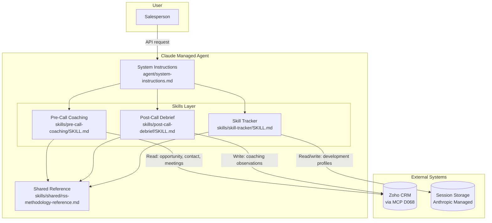

# RSS Platform — Phase 1 Architecture

**Version:** 1.0
**Date:** 2026-04-10
**Directive:** D098

---

## Overview

The RSS Platform is a Claude Managed Agent deployment that encodes Proudfoot's Relationship Selling Skills (RSS) methodology. The agent provides pre-call coaching, post-call debriefs, and skill development tracking for Proudfoot's internal sales team.

Phase 1 is an internal proof of concept (PoC). The agent is accessed via the Claude API. There is no web frontend in Phase 1.

---

## Architecture Diagram

---

## Skill File Structure

Each capability is encoded as a SKILL.md file following the Sales Engine pattern:

| Section | Purpose |
|---------|---------|
| YAML frontmatter | Skill name and routing description |
| Overview | What the skill does and which reference it loads |
| Quick Reference | Key elements and requirements at a glance |
| When to Use | Trigger conditions for skill activation |
| Inputs to Gather | What the agent collects before proceeding |
| Workflow | Step-by-step coaching process |
| Operational Rules | Rules governing coaching quality |
| Anti-Patterns | Explicitly prohibited behaviours |
| Contextual Parameters | Inputs that modify the coaching output |

---

## CRM Integration

The agent connects to Zoho CRM via the MCP connector (D068):

**Read operations (pre-call):**
- Accounts module: company context, account classification
- Contacts module: contact relationship and history
- Deals module: opportunity stage and value
- Events module: meeting history and outcomes

**Write operations (post-debrief):**
- SF_Notes module: structured coaching notes (RSS units applied, customer responses, matrix position, next actions)
- Deals module: stage updates and contextual notes

---

## Session Persistence

The Claude Managed Agent platform provides session persistence across conversations. The RSS Platform uses this to maintain:

- Per-salesperson competency profiles (unit scores, observation log, trend assessment)
- Situational Matrix position history per customer opportunity
- Active development focus unit
- Prior coaching conversation context

---

## Phase 1 Scope

| In Scope | Out of Scope |
|----------|-------------|
| Pre-call coaching | Manager dashboard |
| Post-call debrief | Role-play simulator |
| Skill development tracking | Deal strategy advisor (MH replacement pending Lab) |
| Zoho CRM read/write via MCP | Web frontend / SWA deployment |
| Single-agent per salesperson | Multi-agent manager/seller hierarchy |

---

(c) 2026 Proudfoot. All rights reserved. Confidential and proprietary.
